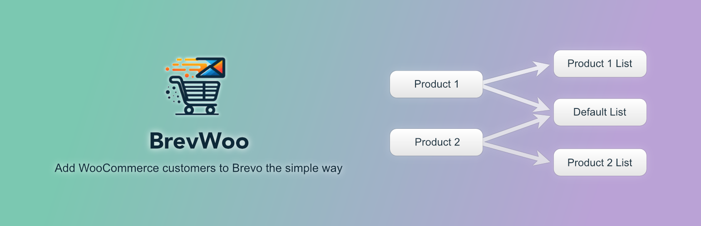

# BrevWoo 

> WordPress plugin that adds WooCommerce customers to Brevo lists.

Set default Brevo lists that customers are added to when they buy a product, and/or set lists for specific products.

## Features

-   Customer added to default Brevo lists selected in plugin settings
-   Customer added to product-specific Brevo lists selected on edit product page
-   Configuration of when during checkout a customer is added to Brevo
-   Customer name and email attributes included in the created Brevo contact
-   [Transactional attributes](https://help.brevo.com/hc/en-us/articles/10635646979218-Create-and-manage-transactional-attributes) included in the created Brevo contact
-   Optional debug entries added to WooCommerce logs

## Installation

Install from the [WordPress Plugin Directory](https://wordpress.org/plugins/brevwoo/) or grab a ZIP from
[Releases](https://github.com/AlecRust/brevwoo/releases).

Once activated, add your [Brevo API key](https://developers.brevo.com/docs/getting-started#quick-start) at
**Settings > BrevWoo**.

## Development

Ensure you have the following installed:

-   [Node.js](https://nodejs.org/)
-   [Composer](https://getcomposer.org/)
-   [Docker](https://www.docker.com/)

Start a WordPress instance for developing this plugin:

1. `npm install`
2. `composer install`
3. `npm run env start`
